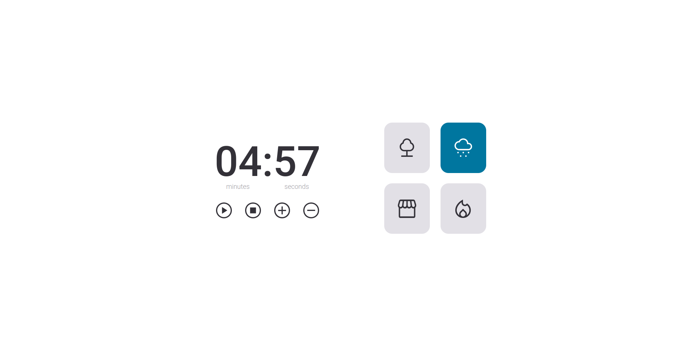

# Focus Timer 2.0
Stage 05

    

 

## 🖥💻 Projeto
Focus Timer é um projeto Web Responsivo de um gerenciador de tempo do tipo Pomodoro, com cronômetro e diversos sons de background.

## 🚀 Tecnologias

 
 
 
 
 

## 🏷 Layout
Você pode visualizar o layout do projeto através desse [link](https://www.figma.com/file/dY59NBgOPLq2DG2rKgyDsB/Stage-05---Focus-Timer-2.0-(Copy)?type=design&node-id=0-1&t=FfU6PKJeOWBlY7Q2-0).
É necessário ter uma conta no [Figma](https://www.figma.com)