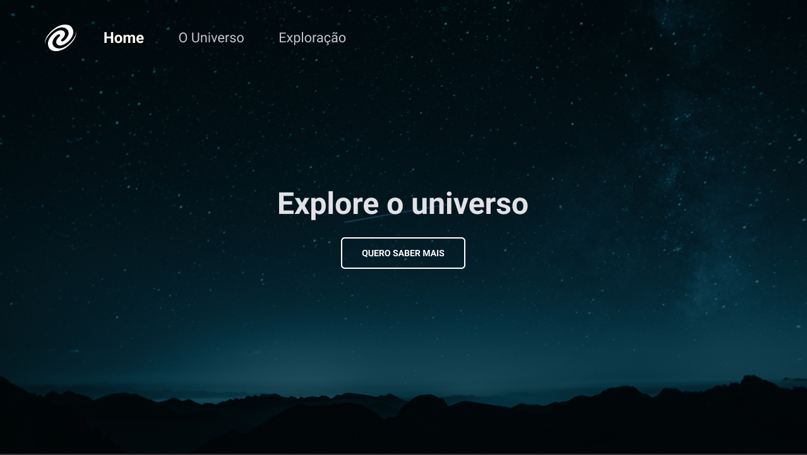
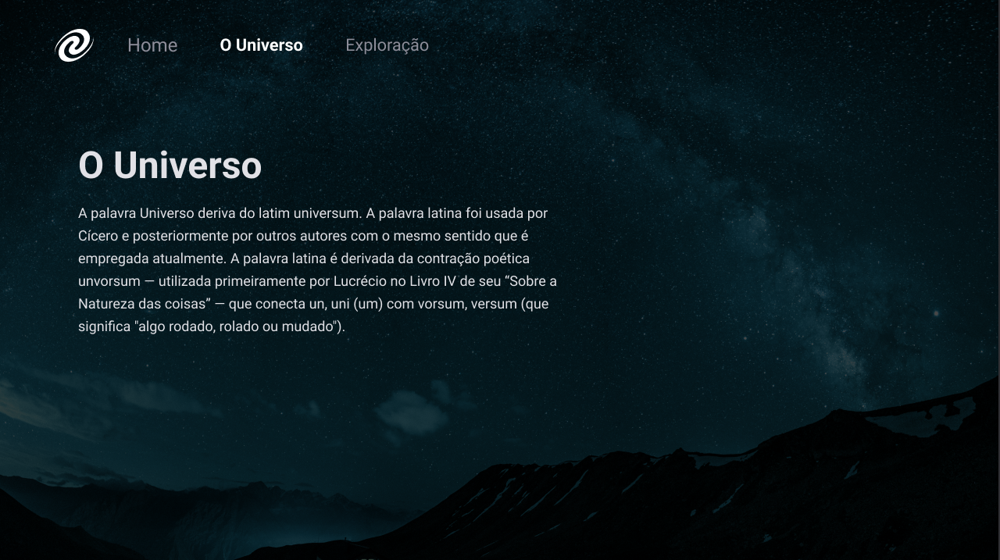

# Single Page Application Universe
Stage 06

    

     

     

## 🖥💻 Projeto
SPA Universe é um projeto Web Responsivo que põe em prática os conceitos de Single Page Application, mapeamento de rotas, manipulação de métodos da DOM, promises e método assíncrono do javascript, orientação a objetos, entre outros.

## 🚀 Tecnologias

 
 
 
 
 

## 🏷 Layout
Você pode visualizar o layout do projeto através desse [link](https://www.figma.com/file/M540vrqlovPk3VXneNdXtT/Desafios-Explorer-SPA-Universe-Copy?fuid=1093307177502148042).
É necessário ter uma conta no [Figma](https://www.figma.com)
